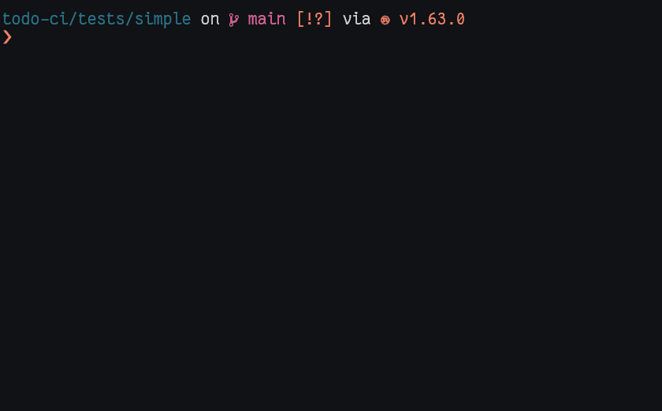

# todo-ci

Check your code TODOs (and fail your ci/cd if they're overdue) 

## Quickstart

Write your todos in the format: `@todo(YYYY-MM-DD): A description of a todo...`

```rust
fn main() {
    // @todo(2022-08-10): Print something besides "Hello World!"
    println!("Hello World!");

    print!("Hello World again!");  // @todo(2022-07-10): use `println` instead of `print`
}
```

Run `todo-ci` to check for overdue TODOs in the current directory

```bash
# Local installation
todo-ci ./

# Docker
docker run -v $(pwd):/volume -it ghcr.io/aliadnani/todo-ci:latest /volume
```




## Usecase

Integrate `todo-ci` in the ci/cd platform of choice for checking TODOs in code. If any overdue TODOs are found, a `1` exit code is emitted, hence failing ci/cd runs.

## Installation

Using `cargo`:

```bash
cargo install todo-ci
```

Using `docker`:

```bash
# Pull the latest image
# See https://github.com/aliadnani/todo-ci/pkgs/container/todo-ci
docker pull ghcr.io/aliadnani/todo-ci:latest
```

## Features

```bash
Options:
  -n, --no-ignore
          For disabling ignored files by default (.gitignore, hidden files, etc.)
  -e, --no-error
          For disabling returning system error code (1) if there are overdue todos
  -d, --display-mode <DISPLAY_MODE>
          Display mode:
           - concise: total number of valid + overdue todos
           - overdue-only: total number of valid + overdue todos + details of overdue todos
           - default: total number of valid + overdue todos + details of all todos
           [default: default] [possible values: concise, overdue-only, default]
  -p, --pattern <IGNORE_PATTERN>
          Pattern to check `todos` for (i.e. `*.rs` , `main.*`, etc.) [default: *]
  -t, --timezone-offset <TIMEZONE_OFFSET>
          Timezone to use for date checking [default: +00:00]
  -h, --help
          Print help information
  -V, --version
          Print version information
```


